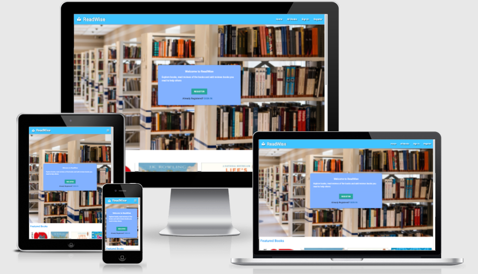
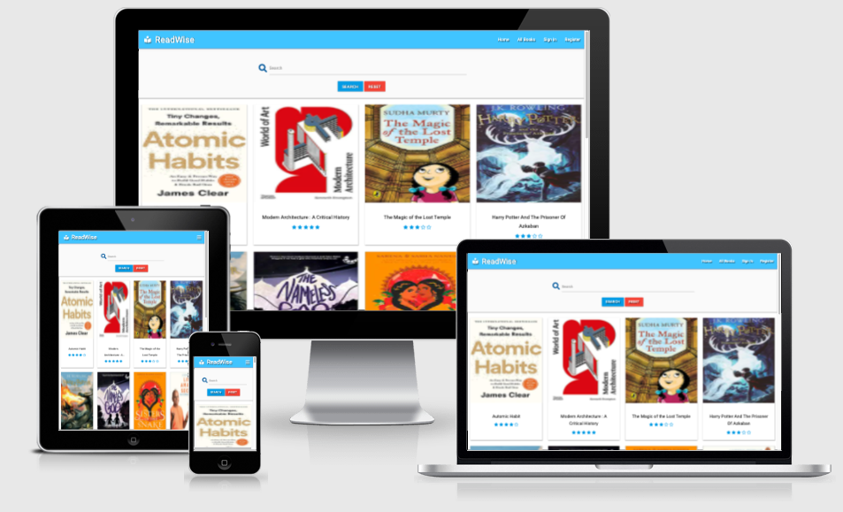

# **ReadWise- MS3**
    




For live website [click here](https://read-wise.herokuapp.com/)

For GitHub repository [click here](https://github.com/rajendradanve/readwise)

##   **Table of Content**

 1. [About](#About)
 2. [UX](#UX)
    *   [Project Goals](#project-goals)
    *   [Targeted Audiance](#targeted-audiance)
    *   [User Goals](#player-goals)
    *   [Developer Goals](#developer-goals)
    *   [User Stories](#user-stories)
    *   [Design Choice](#design-choice)
    *   [Wireframes](#wireframes)

 2. [Features](#features)
    *   [Existing Features](#existing-features)
    *   [Features Left to Implement](#features-left-to-implement)

3.  [Technologies Used](#technologies-used)
   
4.  [Testing](#testing)

5. [Deployment](#deployment)

6. [Credits](#credits)

7. [Acknowledgements](#acknowledgements)
  

 # **About**
 This is my third project to exibhit my learning during backend development. 
 For this project I made a website name [ReadWise](https://read-wise.herokuapp.com/).
 ReadWise is the website to register book with summary and other book information and allowing users to add book reviews. 
 This will help book readers to get overview of the books before buying it. Books are categorized based on subject, language and age group. 
 This website also gives direct link to buy this book. Register user can provide star rating and write review about the book. 


 # **UX**

##  **Project Goals**
Goal of this website is to add as much as book information along with user reviews as possible. 
Register user to add different books and reviews for already added book.
Book will provide information such as author, category, age group, language and basic book summary. User will also able to buy book online by  provided buying link. Non register users will able to browse or search book and read book information and reviews.  
Admin (website owner) of the website has authority to add or delete category and language, set book as featured book and delete book. User who added book can also delete their book. 

## **Targeted Audiance**
- This website can be use by any book reader.
- Non register users can browse or search book and read related book information along with reviews.
- Register users can add, delete and provide book review which can help to other readers.


##   **User Goals**

**Goad for Non-register Users** 

* Simple webpage layout    
* Get overview of the some good books at main page.
* Easy navigaton tab to access to all books page.
* Getting good information about book along with reivews if available.
* Easy access to register as new user. Minimal information to fill to register as new user.

**Goal for Register Users**

* Good and simple page layout for all pages.
* Easy access to sign in page.
* Simple accessable page to add new book with proper informaiton such as category, language, age-group, book summary, buying link etc.
* Possibility to add review for the book along with review stars which helps other book readers.
* Possibility to delete book added by register user.

**Goal for Admin**

* Good and simple page layout for all pages which suitable for all users.
* Able to add book. 
* Able to set book as featured or non featured.
* Simple accessable page to add new book with proper informaiton such as category, language, age-group, book summary, buying link etc.
* Possibility to add review for the book along with review stars which helps other book readers.
* Possibility to delete book added by any users.
* Possibility to add or delete category and language.

**Developer Goals**

To develop the ReadWise website which has
* Shows developer's understanding of backend development along with interactive front end.
* Simple webpages with simple layout which to be accessable by register and also non register users.
* Webpages suitable for all screen sizes. 
       
# **User Stories**

**Non-register User**

* As a non register user, I shall able to access book list and book pages to get more information without registration.
* As a non register user, I want to be able to register as new user on the site.

**Registered User**

* As a registered user, I shall able to sign in and sign out off the site successfully.
* As a registered user, I shall able to access all pages meant for registered users.
* As a registered user, I shall able to add new book. 
* As a registered user, I shall able to add review and star rating to any book.
* As a registered user, I shall able to edit book added by me.
* As a registered user, I shall able to delete book added by me.

**Admin**

* As a admin, I shall able to sign in and sign out off the site successfully.
* As a admin, I shall able to access all pages.
* As a admin, I shall able to add new book. 
* As a admin, I shall able to add review and star rating to any book.
* As a admin, I shall able to edit or delete book added by anyone.
* As a admin, I shall able to add or delete category and language.

# **Design Choice**

## **Framework**

ReadWise used [materializecss](https://materializecss.com/) for its design.
Materializecss is a modern responsive front-end framework based on Material Design.

## **Colour Scheme**

The main colors used are as light blue accent-2 (#40c4ff) for navbar and light blue assent-4 (#0091ea) used for footer. Also used blue accent-1 (#82b1ff) at some sections. 
Refer to [materializecss color](https://materializecss.com/color.html) for more details about these colors.  


## **Typography**

Roboto font is mainly used throughout the website with a sans-serif as a backup font in case of any reason the font isn't being imported into the site correctly.
Roboto isclean font to read and correctly goes with a simple design. Fonts are imported using [Google Fonts](https://fonts.google.com/).

## **Pages**

Readwise has 12 pages all together.
Homepage - Showing featured books
All Book - Showing all books
Register - To register new user
Sign In - To sign in user
Profile - To show profile for admin and register users
Add Book - To add new book
Add Language - Add new language 
Delete Language - Delete language
Add Category - Add new category
Delete Category - Delete category

#  **Wireframes**

*   [Desktop wireframe](static/wireframe/ReadWise-DesktopWireframe.pdf)

*   [Tablet wireframe](static/wireframe/ReadWise-TabletWireframe.pdf)

*   [Mobile wireframe](static/wireframe/ReadWise-MobileWireframe.pdf)

# **Features**

## **Existing Features**

- Showing featured books decided by admin.
- Adding new book which are categorized based on type of book, suitable age-group, language.
- Register user able to edit or delete books added by himself.
- Admin able to add, edit or delete any books.
- Admin able to set featured book.
- Admin able to add or delete category or language.

## **Features Left to Implement**

- Allow user to change password. 
- Finding cheapest buying link automatically.
- Finding E-reader and audio book link if available.
- Able to sort books based on category, language or age-group.
- Ability to save favorite books for future reference.
- Getting user email during registration and sending recommendaded books weekly.
- Pagination for to avoid showing all books on one page.

# **Technologies Used**

## **Languages Used**

- [HTML5](https://en.wikipedia.org/wiki/HTML#:~:text=The%20HyperText%20Markup%20Language%2C%20or,displayed%20in%20a%20web%20browser.)
  - The language used to give the site its main structure and all necessary features.

- [CSS3](https://en.wikipedia.org/wiki/CSS)
  - The language used to give the application its visual effects including the font, color, and layout, etc.

- [Javascript](https://developer.mozilla.org/en-US/docs/Web/JavaScript)
  - Used for activiating materialized functionality

- [Python](https://www.python.org/)
  - Use to build main logic of the website.

## **Frameworks, Libraries, Programs & Tools Used**

- [Bootstrap](https://getbootstrap.com/)
    - Bootstrap library is used to create responsive design, beautiful buttons, modal templates.

- [Jquery](https://jquery.com/)
    - Jquery library used to create DOM elements, event handling, animation.

- [Flask](https://flask.palletsprojects.com/en/1.1.x/)
  - Flast template is used to manage all HTML pages.

- [Jinja](https://jinja.palletsprojects.com/en/3.0.x/)
  - Jinja template is used along with Flask 

- [Heroku](https://www.heroku.com/home)
  - Used for hosting website

- [MongoDB](https://www.mongodb.com/)
  - Used to store database from book

- [Github](https://github.com/)
  - Github is used to create, store and maintain all codes in a repository.
  
- [Git Version control](https://git-scm.com/)
  - Git 2.30.1 for Mac is used for commit and push codes to Github.

- [Google Fonts](https://fonts.google.com/)
  - The font used for text is imported from google fonts.

- [Fontawesome](https://fontawesome.com/)
  - The icons used for this game are taken from fontawesome.

- [Balsamiq](https://balsamiq.com/)
  - The wireframes were created using Balsamiq.

- [Google DevTools](https://developer.chrome.com/docs/devtools/)
  - Google DevTools was extensively used throughout the project for various styling, testing, performance and debugging purposes.

- [Am I Responsive](http://ami.responsivedesign.is/)
  - Am I responsive to create the mock-up image presented at the start of this document.

- [W3C Markup Validation service](https://validator.w3.org/)
  - W3C Markup Validation Service has been used to test the HTML codes.

- [W3C CSS Validation Service](https://jigsaw.w3.org/css-validator/)
  - W3C CSS Validation Service has been used to test the CSS codes.

- [Code Beautifier](http://minifycode.com/html-beautifier/)
    -   The tools to minify and beautify JavaScript, CSS, and HTML codes.

- [PEP8 Online](http://pep8online.com/)
  - Used to check Python Code is PEP8 compliant.

- [WAVE](https://wave.webaim.org/)
  - Used to test accesibility of site.

# **Mongodb Database**
Mongodb database for ReadWise website consist of mainly 6 collections as below.

- books
  - Collection for all books data.
- users
  - Collection for all registered users.
- age_group
  - Collection for selecting age group while adding a book.
- categories
  - Collection for book categories.
- languages
  - Collection for all languages.
- comments
  - Collection for all comments by different users for different books.

# **Testing**

Testing documentation can be found separately at [TESTING.md](TESTING.md)

# **Deployment**

The site is hosted on [Heroku](https://www.heroku.com/home)

Project files are stored on [GitHub](https://github.com/)

Deployment of ths ReadWise done as per mentioned in code institute mini project. 

## Steps for GitHub and Gitpod

1. Logged into Github account.
2. Create a new repository with name readwise.
3. Open repository in the GitPod IDE.
4. Created a requirements.txt file by using command "pip3 freeze --local>requirements.text" in the terminal window. This will create files which tells Heroku what are dependencies required to be install for this project. 
5. Creat a Procfile for Heroku by command "echo web: python app.py>Procfile" in the terminal window. (Remove any exta line from Procfile as this creates problem sometimes)
6. Commit and push new files to the GitHub

## Steps for Heroku

1. Logged in to Heroku and select "Create New App".
2. Provide unique name in the "App Name" suitable for the website.
3. Select the region closest for you.
4. Click "Create App".
5. Select "Deploy" from the Heroku app menu.
6. From the deployment menu select "GitHub" option.
7. Verify that "Github" profile name is showing int the "Connect to GitHub" section.
8. Search "readwise" repositary and click "Connect" to connect GitHub repositary with Heroku.
9. Select "Settings" from the Heroku App menu.
10. Select "Reveal Config Vars" and add the relevant key and value information. In case of ReadWise it is IP, PORT, MONGO_URI, MONGO_DBNAME, SECRET_KEY.
11. Select "Deploy" from Heroku App menu.
12. Scrolled down the page and select "Enable Automatic Deployent" option.
13. Select "Master Branch" under "Branch Selected". 
14. Click "Deploy Branch"
15. If everything is sucessfull then you get "Deployment Sucessfull message" and Click "View" to launch the app to see website in the browser. 


## **Making a clone or download zip to run locally**

1. Log into GitHub account.

2. Navigate to my repository [ReadWise](https://github.com/rajendradanve/readwise).

3. Click on the Code dropdown button next to the green Gitpod button.

4. Either, download the zip file or clone the repo using  gh repo clone rajendradanve/readwise in the terminal.

5. Install the modules listed in the requirements.txt file using "python -m pip -r requirements.txt" in the terminal.

6. You will need to create a new project in [MongoDB](https://www.mongodb.com/3) create a new collection called "readwise".

7. Create collections as age_groups, books, categories, comments, languages and users. 

8. insert age groups in age_groups collection based on your choice of age groups for book readers. 

9. Create an env.py file in your application folder and add the following:

```
import os

os.environ.setdefault("IP", "0.0.0.0")
os.environ.setdefault("PORT", "5000")
os.environ.setdefault("SECRET_KEY", "[YOUR SECRET KEY]")
os.environ.setdefault("MONGO_URI", "mongodb+srv://<YOUR ROOT>@<YOUR CLUSTER NAME>.hoanu.mongodb.net/readwise?retryWrites=true&w=majority")
os.environ.setdefault("MONGO_DB_NAME", "readwise")

```

Update your own "SECRET_KEY", "YOUR ROOT" and "YOUR CLUSTER NAME" info above.

10. The app can now be run locally by typing "python3 app.py" in the terminal and website will be available in the browser. 


# **Credits**

**Images**
Main page library image is taken from [Pexels](https://www.pexels.com/photo/row-of-books-in-shelf-256541/)

**Text**

Text for added book are mostly taken from [Amazon](https://www.amazon.com/).

Ideas for book categories, age groups are taken from [Book Depository](https://www.bookdepository.com/).

**Code**

- [W3schools](https://www.w3schools.com/) 

  Used in general to solve issues related to HTML and CSS.
 
- [Materializecss](https://materializecss.com/)

  Mostly materializecss card component is used for this website. 

- [Jquery](https://jquery.com/)

  jquery code is used as required by materializecss.

- [MDN Resources](https://developer.mozilla.org/en-US/docs/Web/Reference)

    MDS resources are used to get more understanding some concepts and some regular help

- [Google Fonts](https://fonts.google.com/)
   
   Roboto font link from google fonts used all over the site.

- HTML and CSS for star rating is taken from this [Youtube Video](https://www.youtube.com/watch?v=zDHC4r5eCdY)


**Color**

- Standard color used as given in [Materializecss colors](https://materializecss.com/color.html)


# **Acknowledgements**

I would like to thank:

- My mentor Akshat Garg for his encouragement and valuable comments for this project. 
Thanks to his guidance and tips to improve my code.

- Lessons from code mainly mini project on backend develoopment institute helped a lot during this project. Used regularly to check if I am following the correct method of coding.

- Help from in the Slack community.

- Tutor support and student care team.

Should you have any queries please reach me at rajendradanve@gmail.com.
