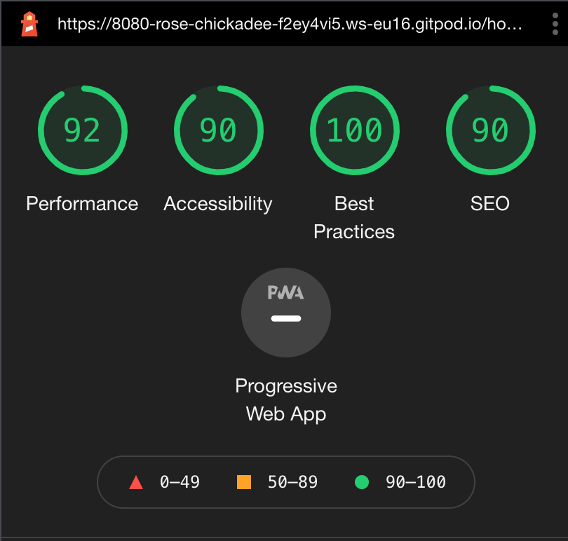

This document is made as a part of a testing section of the ReadWise website

For live website [click here](https://read-wise.herokuapp.com/)

For the GitHub repository [click here](https://github.com/rajendradanve/readwise)

# **Coding Testing**

 **HTML**

HTML is validated using online [HTML Validator](https://validator.w3.org/) tool.
All pages showing errors that can be ignored. Errors are shown for jinja and flask templates

 **CSS**

CSS is validated using the online [CSS Validator](https://validator.w3.org/) tool.
-   **style.css :** The CSS validator did not found any errors.

 **Javascript**

Javascript is validated using the online [JSHint](https://jshint.com/) tool.
-   **script.js :** All JS and jQuery have been passed through the Validator, however, various warnings were presented with regards to the $ in jQuery. This was expected and considered that the code is okay to pass.

 **Python**

- **app.py :** Python code with flask template is checked using [PEP8 Online](http://pep8online.com/). No errors were found with the code.

# **Manual Testing Based on User Stories**

### **General Testing**

- Chrome Developer Tools were used to test responsiveness on different screen sizes.
- Checked the website on different devices available to me which includes desktop, mobile phones.
- Checked the website on different browsers such as Google Chrome, Safari, Edge, and Firefox.
- Asked friends and family members to go through the website to know the issues if any.
- Tested all links working properly.
- All CRUD functions were tested to make sure that they work as intended.

### **Non Register User**

- Verified that home page, all book and register user page available for non registered users.
- Verified that the profile page is not accessible to non-registered users.
- Verified that non-registered users can not submit a review before sign up.
- Checked that when the non-register user tries to register username will be unique.
- Checked that password is validated before the user is registered.

### **Register User**

- Verified that user correctly sign in after entering correct username and password.
- Verified that the register page is not available to sign-in users.
- Verified that review form available to the sign-in user as each book page if the user did not submit reviews already.
- Verified that the user who has reviewed the book gets the message that he already reviewed the book.
- Verified that added book and profile pages are available for the sign-in page.
- Verified that after adding book profile page shows book added by the user with the possibility to edit or delete the book.
- Verified that the user who added the book shall be able to edit the book or delete it.

    
### **Admin**

- Verified that admin correctly sign in after entering correct username and password.
- Verified that all books open correctly for admin and show edit and delete buttons.
- Verified that review form available for admin and admin can add reviews for the book.
- Verified that add book link showed the "featured book" switch option in the form.
- Verified that the profile page shows cards for category and language with add and delete buttons.
- Verified that add category and delete category works properly..
- Verified that add language and delete language works properly.
- Verified that new language and categories shows in add book form.
- Verified that deleted categories and languages were removed from add book form.
- Verified that admin can add and edit book correctly.

# **Automated Testing**

* The Chrome extension [Responsive Viewer](https://chrome.google.com/webstore/detail/responsive-viewer/inmopeiepgfljkpkidclfgbgbmfcennb?hl=en) has been run and checked.

* Website tested on [Mobile-Friendly Test - Google Search Console](https://search.google.com/test/mobile-friendly) and validated correctly.

* Run style sheet code through [Autoprefixer CSS online](http://autoprefixer.github.io/) and pasted prefixed code back into the style sheet.

* Website performance is tested using [Google Lighhouse](https://developers.google.com/web/tools/lighthouse) and below are the screenshot from the result
   

Previously accessibility score was low for the site. Below are the actions are taken to improve the score.

- Background colors adjusted to increase contrast. 
- Aria, Aria-label added to the links

## **Known Bugs**

- In admin profile page button for add category, delete categories, add language and delete language buttons are misaligned for some of the pixel sizes on the medium screen. As this is a minor issue, due to time constraints this will be fixed in near future. 

- Edit and Delete button alignment for different books cards are misaligned based on a book name (1 line or 2 lines). Also some for some sizes on the medium screen there is no gap between buttons. These are minor issues and will be fixed in near future.

    

